layout: true

`r paste0("
", params$event, " 

")` 

---

class: center, middle

Ces slides en ligne : `r paste0("http://datactivist.coop/", params$slug)`

Sources : `r paste0("https://github.com/datactivist/", params$slug)`

Les productions de Datactivist sont librement réutilisables selon les termes de la licence [Creative Commons 4.0 BY-SA](https://creativecommons.org/licenses/by-sa/4.0/legalcode.fr).

 
 

---
class: inverse, middle 

### Objectifs du séminaire 

* Partager mon expérience issue de mon travail avec des réutilisateurs et des producteurs 

* Présenter les principales difficultés de la réutilisation des données ouvertes 

* Découvrir des stratégies alternatives pour obtenir des données quand elles n'existent pas, ne sont pas ouvertes ou ne sont pas exploitables

---
### Quelques mots sur Datactivist

- Datactivist est un société coopérative .red[**pure player de l’open data**] créé en 2016, par Samuel Goëta et Joël Gombin.

- Se positionnant sur .red[**toutes les étapes du travail d’ouverture des données**], Datactivist travaille tant avec les producteurs de données qu’avec les réutilisateurs et participe à l’appropriation des données par chacun.

- Nous appliquons nos propres .red[**valeurs**] : nous sommes une coopérative ; nos supports de formation et nos contenus sont librement réutilisables, publiés en licence Creative Commons.

- Une approche issue de la recherche : voir notamment **https://datactivist.coop/these**. 

- Nous animons la communauté [#TeamOpenData](https://teamopendata.org).

---
### Quelques mots sur Datactivist

Nos métiers : 

- Conseil sur les .red[**stratégies d’ouverture de données**] : nous aidons les organisations dans la conception et la mise en œuvre de leur stratégie d’ouverture de données.

- .red[**Accompagnement dans la réutilisation de données ouvertes**] : nous aidons les organisations à utiliser les données au quotidien. 

- .red[**Sensibilisation et formation à la donnée**] : nous formons à la culture générale des données, nous enseignons les grands principes et bonnes pratiques de l'open data et nous introduisons à la data science. 

- .red[**Médiation de données**] : nous organisons des hackathons, des open data camps, des expéditions de données...

---
### Datactivist : une entreprise née de la recherche

.center[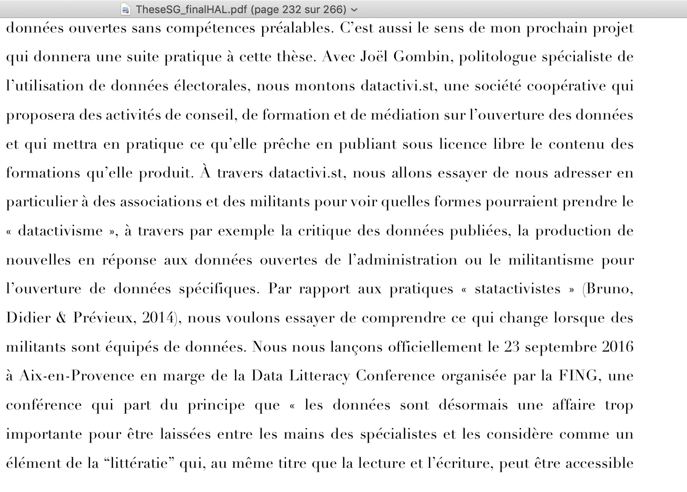]

.footnote[Extrait de la conclusion de ma thèse : https://datactivist.coop/these]
---
class: inverse, center, middle

# Open data : quelques éléments de contexte

---
### [.red[L'open data : ]](https://books.openedition.org/cdf/5005?lang=fr) une notion aux multiples facettes

.reduite.center[]

---
### Des principes techniques qui se sont imposés

.pull-left[
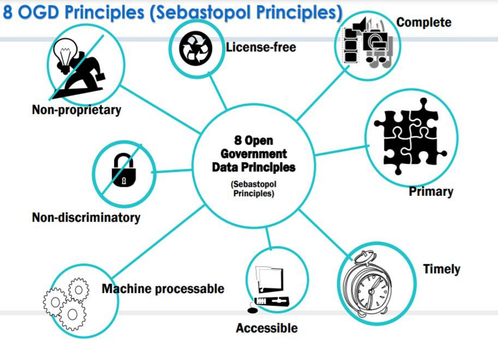
]

--
.pull-right[
>"Un régime fermé pourrait divulguer de grandes quantités de données conformes à ces huit exigences […] Une diffusion électronique des déclarations de propagande faites par les dirigeants politiques de la Corée du Nord, par exemple, pourrait satisfaire à ces huit exigences."

>Yu & Robinson (2012) « [The New Ambiguity of Open Government](https://papers.ssrn.com/sol3/papers.cfm?abstract_id=2012489) » 
]
---

### Loi pour une République Numérique : l'ouverture des données par défaut

Promulguée le 7 octobre 2016, après 4 ans d'annonces et de consultation, le titre 1 de la [loi pour une République  Numérique](https://www.legifrance.gouv.fr/affichTexte.do;jsessionid=B5632993E54F7CCC2606664B64CDF612.tpdila11v_1?cidTexte=JORFTEXT000033202746&categorieLien=id) porte sur l'ouverture des données publiques. 

La loi impose un principe d'.red[**ouverture des données par principe**] qui ne fait pas l'objet de sanctions à toutes les administrations, les entreprises délégataires d'une mission de service public et les .red[**collectivités locales de plus de 3500 habitants et 50 agents**]. 

L'ouverture concerne un .red[**périmètre très large**] : 
* les documents communiqués suite à des demandes CADA
* les "bases de données"
* les données "dont la publication présente un intérêt économique, social, sanitaire ou environnemental".
Rares sont donc les données publiques qui ne sont pas concernées par cette obligation d'ouverture. 

---
### Une loi qui peine à être appliquée

Selon l'observatoire open data des territoires, seulement 10% des collectivités concernées par la loi pour une République numérique ont ouvert au moins un jeu de données.  
.reduite[
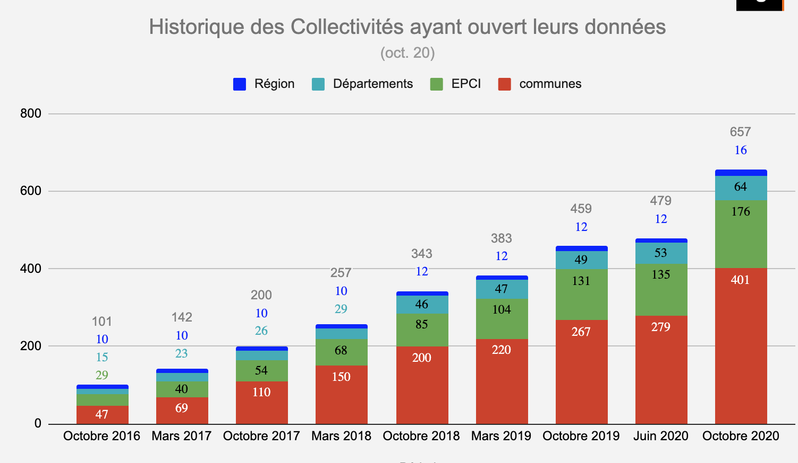]

.footnote[[Source](http://www.observatoire-opendata.fr/resultats/)]

---
### Le long chemin de l'ouverture d'un jeu de données

.pull-left[
.reduite[]
]

.pull-right[
.middle[* Un travail invisible 

* Un travail rarement pris en compte dans les missions des agents

* Opérer une "inversion" de l'infrastructure (Bowker, 1994 ; Star, 1999)]
]

---
class: inverse, center, middle

# 4 défis de la réutilisation des données ouvertes

---

### .red[Défi 1 :] la découvrabilité des données

.center[**Découvrabilité** : capacité d'un contenu à sortir du lot]

--

.center[ou plutôt la **trouvabilité** : capacité pour un usager de tomber sur le bon contenu]

--
.pull-left[
> **La découverte des données est une condition préalable pour que les données ouvertes atteignent leur potentiel et la plupart des données sont actuellement difficiles à trouver.**
]

.pull-right[
.center[] 
]

.footnote[https://index.okfn.org/insights/]

---
### Un exemple de problème de .red[découvrabilité]

---
### Un exemple de données .red[introuvables]
Ce jeu de données contient plus de 6000 marchés publics attribués par l'Etat. Mais, malgré mon [signalement](https://www.data.gouv.fr/fr/datasets/aife-de-44785462100045/#discussion-5c5d2857634f41019657c80d-0), tout est fait pour le rendre introuvable !

[.reduite[]](https://www.data.gouv.fr/fr/datasets/aife-de-44785462100045/)

---
### Autre exemple de problèmes de .red[découvrabilité]

Sur data.gouv.fr, une requête "coronavirus" ne renvoie vers aucun jeu de données publié par Santé Publique France. Il faut rechercher "covid" pour les trouver, du nom de la maladie causée par le SARS COV-2. 

.center[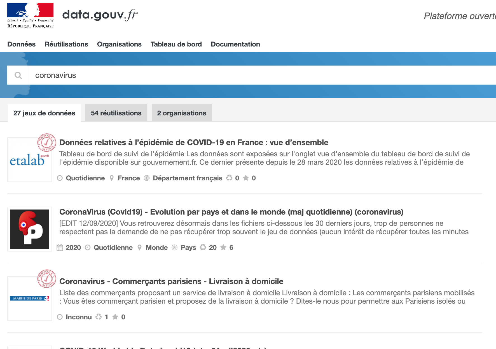]

---
### Autre exemple de problèmes de .red[découvrabilité]

Ce fichier contient tous les signes officiels de la qualité et de l'origine (SIQO) : les AOC et AOP, IGP, Label rouge, spécialité traditionnelle garantie, Agriculture biologique… Très utile mais qui peut le trouver sur data.gouv.fr ?

---
### .red[Défi 2 :] la documentation des données

.pull-left[
Beaucoup de données sont accompagnées d’une description très réduite. 

Sans ces informations, il est très difficile pour un usager de comprendre ce que contient le jeu de données, ses conditions de production des données et ses limites.]

.pull-right[

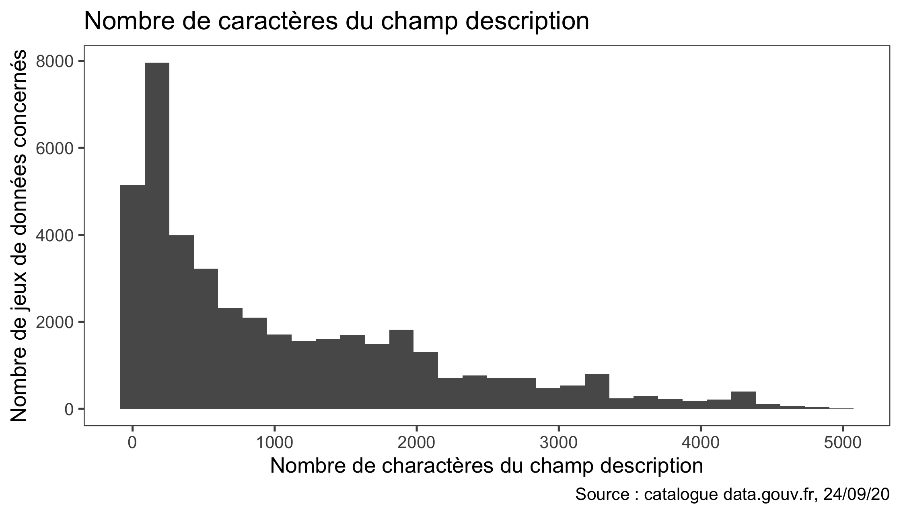

Sur data.gouv.fr, **22% des jeux de données** ont une description de moins de 180 caractères (un sms)

**59% ont moins de 1000** caractères (une demi-page)

]

---
### Un exemple de problème de .red[documentation]

Ce jeu de données sur les élections présidentielles de 2002, très réutilisé, comporte un champ description plus court que le titre du jeu de ddonnées.
.center[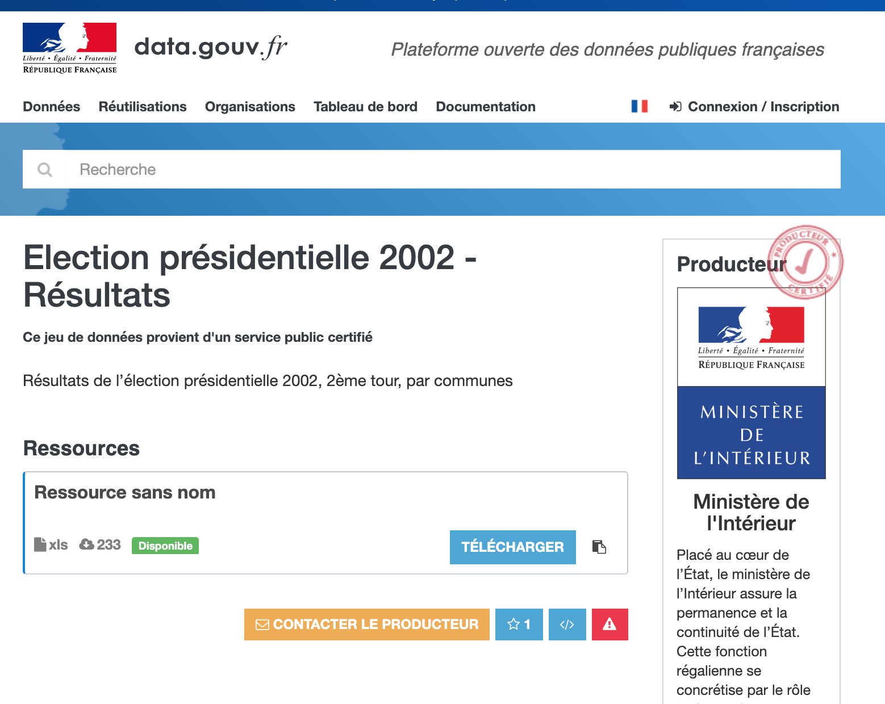]

---
### Un autre exemple de problème de .red[documentation]

Ici, la documentation est très succinte et ne fait que reprendre le libellés des colonnes. Or, qu'est ce qu'un musée de France ? comment les données sont collectées ? quand vont-elles être mises à jour ?
.center[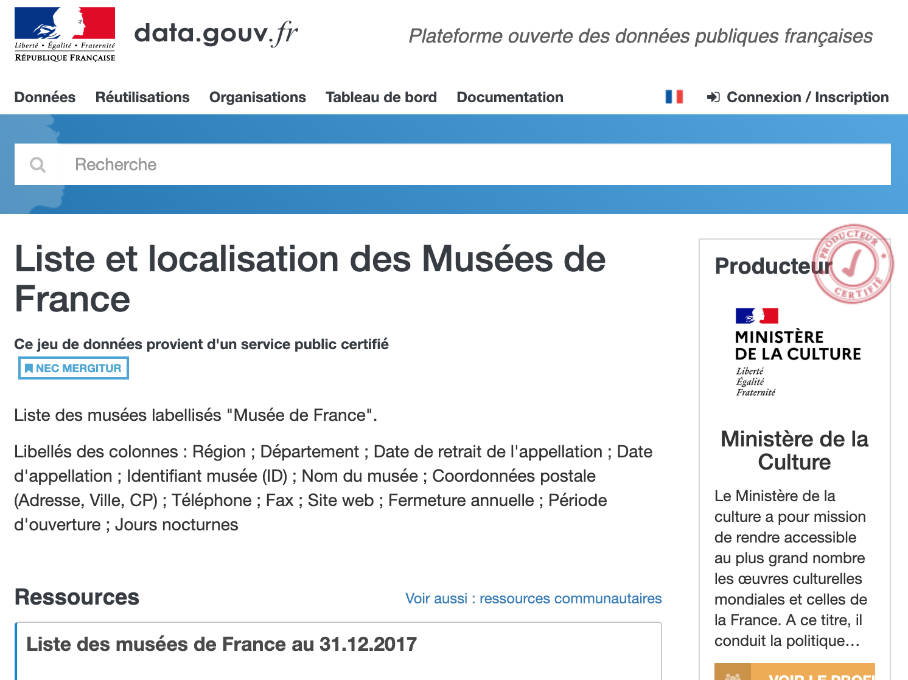]

---
### Un autre exemple de problème de .red[documentation]

Pour ces données, la description est relativement longue **mais…** elle ne fait que reprendre les termes de la licence, après un premier paragraphe très peu informatif. 
.center[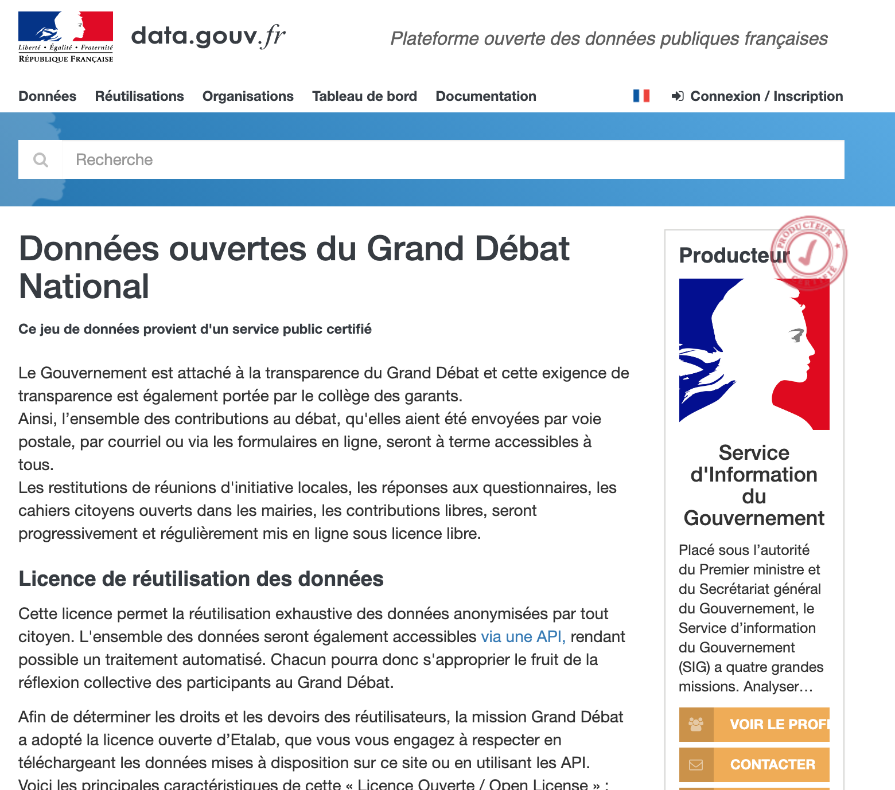]

---
### .red[Datasheet for Datasets] : une approche alternative pour la documentation des données

.pull-left[

[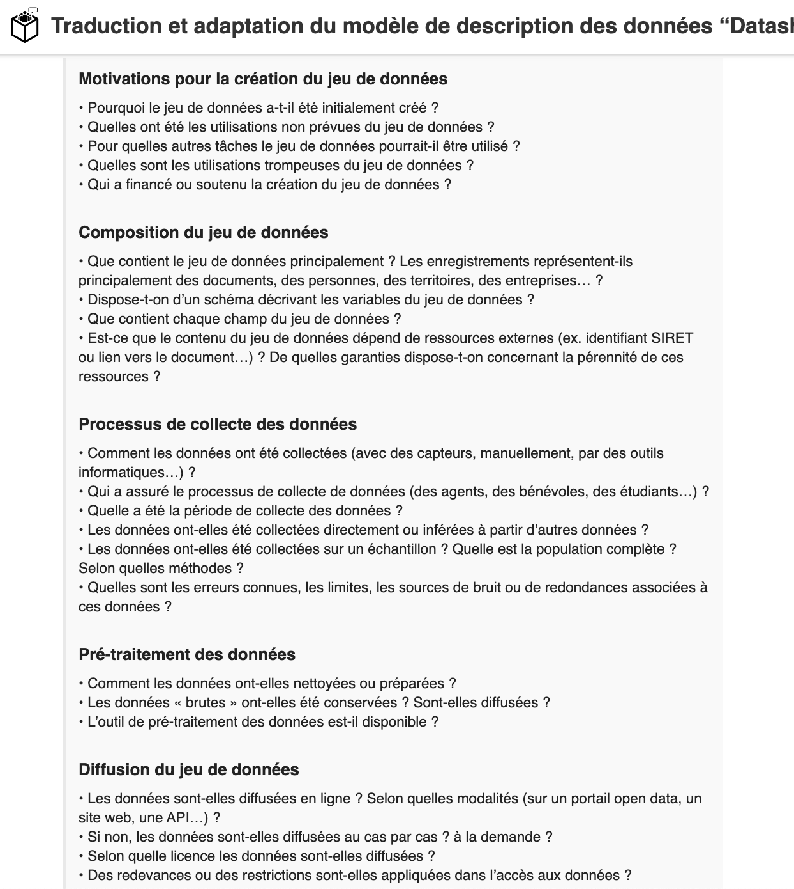](https://teamopendata.org/t/traduction-et-adaptation-du-modele-de-description-des-donnees-datasheet-for-datasets/1400)

]

.pull-right[
* Motivations pour la création du jeu de données

* Composition du jeu de données

* Processus de collecte des données

* Pré-traitement des données

* Diffusion du jeu de données

* Maintenance du jeu de données

* Considérations légales et éthiques

]
---
### .red[Défi 3 :] la qualité des données

Enfin, le troisième défi porte sur la **qualité** des données. 

Le rapport de [l’Open Data Barometer](https://opendatabarometer.org/4thedition/report/) signale  que :
> “les données des gouvernements sont souvent incomplètes, pas actualisées, de mauvaise qualité et fragmentaires”
et 

> “de manière générale, la gestion et la publication des données ouvertes sont fragiles et sujettes à des erreurs multiples.” 

⚠ la qualité des données ne dépend que de l’usage qui en est fait. 

La documentation est indispensable pour que le public parvienne à saisir les usages précédents des données et les adapte à de nouveaux usages, souvent inconnus de celles et ceux qui les produisent. 

---
### La qualité : une notion à prendre avec des précautions 

Garfinkel et Bittner (1967), deux sociologues confrontés à des difficultés d'exploitation de dossiers médicaux, ont été tentés de dénoncer la « mauvaise qualité » du remplissage de ces dossiers. 
 
Mais ils ont montré que les dossiers médicaux ont « **de bonnes raisons organisationnelles** » d’être « mal » remplis. 

Le personnel de l’hôpital collecte des informations pour ses propres missions dans un contexte organisationnel orienté vers un certain type d’actions, le soin des patients, et non la recherche en sciences sociales. 

Les dossiers médicaux comme les données sont des **écrits organisationnellement situés**. Ce sont des données métiers, **produites généralement à des fins de gestion**, qui deviennent un objet de savoir et de pouvoir.

---
### La circulation des données provoque des frictions

> A chaque interface entre deux surfaces, **la friction consomme de l’énergie, produit de la chaleur et use les parties en mouvement**. La métaphore d’Edwards des frictions de données décrit ce qui survient à l’interface entre les « surfaces » de données : les points où les données bougent entre les personnes, les couches sociales, les organisations ou les machines […] Chaque mouvement de données à travers une interface a un coût en temps, énergie et attention humaine. Chaque interface entre groupes et organisations, ainsi qu’entre les machines, représente un point de résistance où les données peuvent être rendues incompréhensibles, mal interprétées ou perdues. Dans les systèmes sociaux, les frictions de données **consomment de l’énergie et produisent des turbulences et de la chaleur**.

.footnote[Edwards, Paul N., et al. “[Science Friction: Data, Metadata, and Collaboration](www.jstor.org/stable/41301955).” Social Studies of Science, vol. 41, no. 5, 2011]

---
### Un exemple de données inutilisables

---
### Un autre exemple de données inutilisables

---
### .red[Défi 4 :] les échanges entre producteurs et réutilisateurs

Pour répondre aux problèmes identifiés par les usagers liés à la découvrabilité, la documentation ou la qualité, on pourrait, plutôt que de les résoudre immédiatement, s'appuyer sur les commentaires et les retours des usagers pour identifier les priorités. 

Mais en pratique, la plupart des agents en charge de l'ouverture n'ont pas de temps dédié à traiter ces commentaires et à les résoudre. 

Résultat : les échanges se font rares et les usagers n'ont souvent pas de réponse. Sur data.gouv.fr, **40,5% des discussions** n'ont qu'un seul message, la question initiale. Les producteurs ne répondent pas systématiquement.

---
class: inverse, center, middle

# 4 stratégies alternatives pour obtenir des données

---
### Stratégie 1 : recourir au .red[droit d'accès] 
.pull-left[* Le fondement : la .red[Déclaration des Droits de l'Homme et du Citoyen de 1789] dans son article 15, "la Société a le droit de demander compte à tout Agent public de son administration." 

* Le droit d'accès des citoyens à l'information publique émerge en **1978 avec la loi dite CADA** du nom de la Commission d'Accès aux Documents Administratifs. 

* 3e pays au monde après la Suède en 1766 et les Etats-Unis en 1966 avec le Freedom of Information Act (FOIA) en 1966  à accorder un "droit de savoir".]

.pull-right[

]

---
### Les conditions d'exercice du droit d'accès

.red[ Une définition très large des documents administratifs]
> Les documents administratifs peuvent revêtir de nombreuses formes (dossiers, rapports, études, comptes rendus, procès-verbaux, statistiques, directives, instructions, circulaires, codes sources, etc.) et adopter tout support (écrit, enregistrement sonore ou visuel, forme numérique ou informatique). 

Le droit d'accès s'appplique aux documents administratifs produits dans le cadre d'une .red[mission de service public] ie :
> Une mission d'intérêt général sous le contrôle de l'administration et qui est dotée à cette fin de prérogatives de puissance publique est chargée de l'exécution d'un service public. 

Il ne s’exerce que si l’administration a effectivement en sa possession le document demandé, que si le document est formellement **achevé**, qu'il existe et qu'il n'est pas **préparatoire à une décision administrative** en cours. 

---
### Madada.fr : faciliter l'exercice du droit d'accès

---
### Stratégie 2 : .red[Scraper] les données du web

Le scraping consiste à **extraire les données présentes sur des sites** web généralement dans des pages éparses. Il est courant qu’une organisation diffuse des données sur le web mais ne mette pas à disposition les données derrière ces sites.Or, pour beaucoup de sites publics, ces données auraient vocation à être librement réutilisables par toutes et tous. 

Les outils de scraping permettent de **cibler les éléments à extraire sur les pages** (généralement par leurs propriétés dans le code source de la page ou dans la feuille de style), de lister toutes les pages concernées et d’extraire les éléments dans une base de données structurée.

---
### NosDeputes.fr : un projet citoyen né du scraping

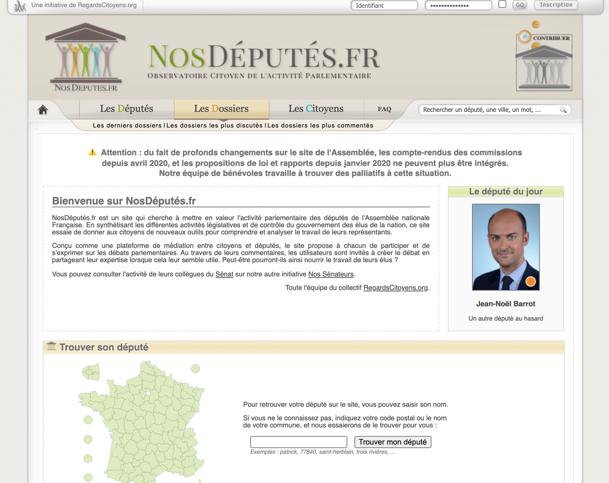

---
### Le Monde : un projet de scraping

Le journaliste Alexandre Léchenet avait réalisé en 2012 une enquête sur les dépassements d’honoraires des médecins pour Le Monde en extrayant les données du site ameli-direct.fr qui indique les tarifs habituellement exercés par chaque praticien. 

.center[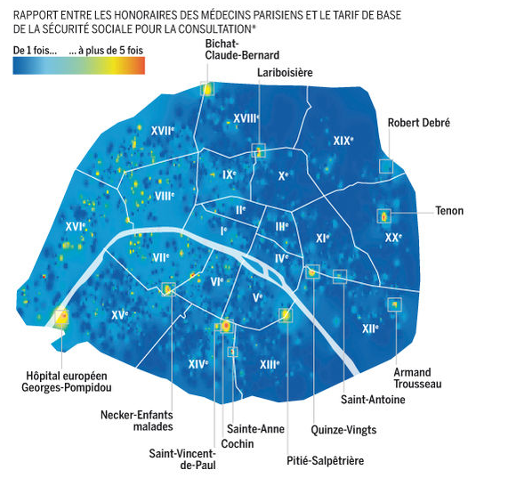]

---
### Cimade : à guichets fermés
la Cimade, une association de défense des réfugiés et du droit d’asile, a mis en place le site « A guichets fermés » pour dénoncer l’attente pour les formalités d’immigration devenue « un moyen de domination des personnes étrangères par la préfecture[1]. » Pour produire le site «[ A guichets fermés ](https://www.lacimade.org/presse/a-guichets-fermes-les-personnes-etrangeres-mises-a-distance-des-prefectures/)», l’association a développé des robots qui se rendent toutes les deux heures sur les sites de prise de rendez-vous en préfecture et extraient le délai d’attente pour les principales formalités. 

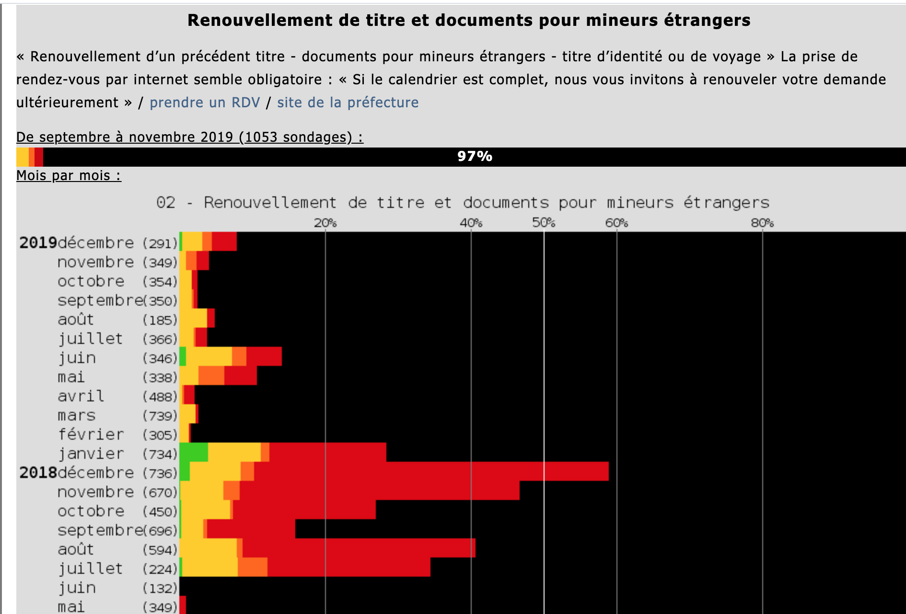

---
### Stratégie 3 : constituer des données à partir des .red[informations disponibles]

La troisième stratégie consiste à rassembler des informations disponibles mais éparses dans une base de données.

Les documents publiés par les administrations comportent généralement des graphiques, des tableaux ou des indicateurs qui, pris isolément, ne permettent pas de refaire les calculs et de produire de nouvelles analyses.

--

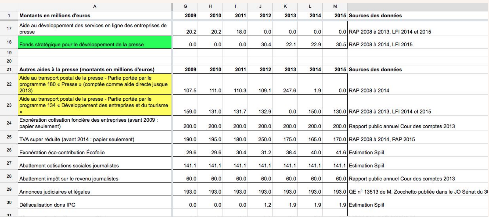Par exemple, le SPIIL a constitué une base de données estimant le montant de chacun des dispositifs d’aide à partir de sources très diverses : rapports annuels de performance établis par Bercy, rapport de la Cour des Comptes, budget de l’Etat, questions au gouvernement ou encore des estimations publiées par le SPIIL…

---
### SPIIL : panorama des aides à la presse

Avec ces données, nous avons conçu des visualisations pour illustrer les messages portés par le SPIIL dans l’analyse de ces données 

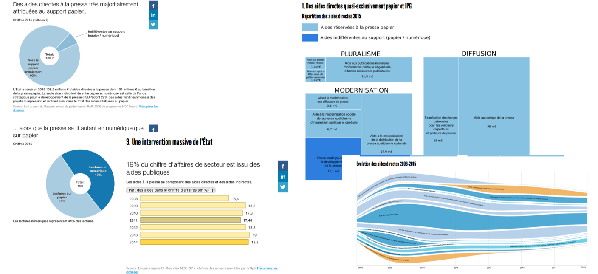

---
### Transparency France : cartographie de la corruption

Un bénévole de Transparency France, surveille les chroniques judiciaires de la presse locale en France pour détecter les affaires de corruption et met les nouvelles affaires en base de données. Le site [visualiserlacorruption.fr](visualiserlacorruption.fr) présente plus de 900 condamnations pour renforcer le plaidoyer de l’association sur le manque de moyens de la justice en France pour lutter contre la corruption. 
.center[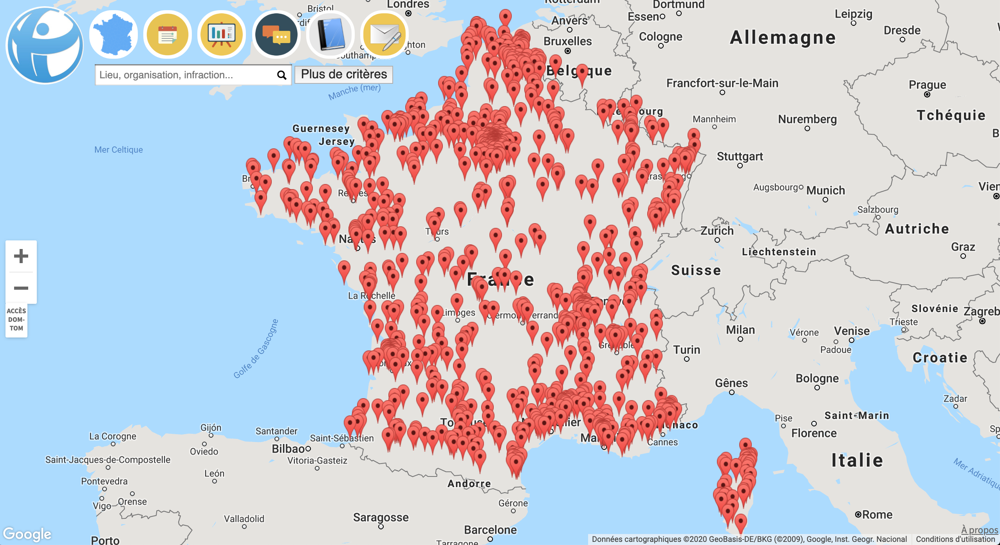]

---
### Stratégie 4 : faire appel à une .red[foule de contributeurs]

On désigne couramment sous le terme de crowdsourcing l’acte de déléguer des actions à un grand nombre d’individus sous la forme d’un appel ouvert à la contribution. 

Le crowdsourcing peut aussi servir à des projets d’intérêt général afin de constituer des bases de données ouvertes. Dans l’ensemble des exemples qui suivent, les contributeurs se sont mobilisés pour collecter des données dans des projets à but non lucratif, souvent afin de servir une cause militante ou pour passion.

---
### Greenpeace : une campagne sur les cantines

Entre septembre 2017 et février 2018, près de 8000 personnes ont collecté des données précieuses sur les menus de cantines des écoles primaires publiques en France : nombre de repas végétariens proposés, fréquence des options végétariennes, origine bio de la viande, intitulés des menus… 

Grâce à cette grande enquête, Greenpeace a recueilli plus de 12 000 contributions couvrant plus de 3 200 villes et au moins 60 % de la population des écoliers. Bien qu’elles ne couvrent pas tout le territoire, ces données ont permis de montrer que 69 % des enfants sont obligés de manger de la viande ou du poisson presque tous les jours. 

---
### Greenpeace : une campagne sur les cantines

Pour en savoir plus : lire [cet article](https://medium.com/datactivist/greenpeace-retour-sur-une-campagne-open-data-pour-rep%C3%A9rer-la-viande-dans-les-cantines-5c12859f94ba) sur notre campagne
.pull-left[
#### Outil de contribution : 

]

.pull-right[
#### Site de plaidoyer et de mobilisation 
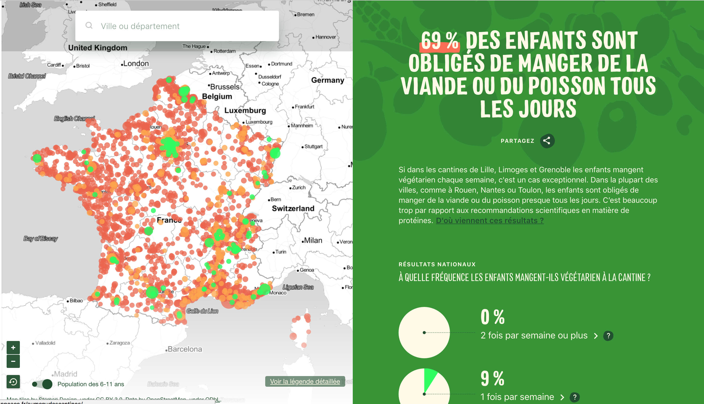
]

---
### Regards Citoyens : numériser les déclarations

En 2014, les déclarations remplies des 577 députés et 348 sénateurs comportant chacune 12 parties, soit un total de plus de 11 000 extraits de formulaires manuscrits, ont été numérisées en une semaine par près de 8000 contributeurs. 

.center[
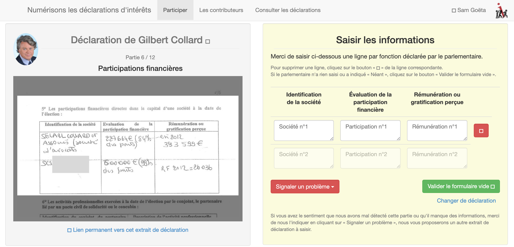
]
---
class: inverse, center, middle

# Merci !

Contact : [samuel@datactivist.coop](mailto:samuel@datactivist.coop)

